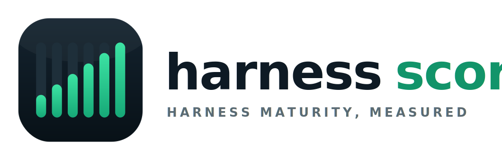

<p align="center">
  <picture>
    <source media="(prefers-color-scheme: dark)" srcset="brand/harness-score-logo-dark.svg">
    
  </picture>
</p>

# Harness Score

**Harness engineering for Cursor repositories — a guide you can read and a
maturity level you can measure.**

[](https://github.com/paladini/harness-score/actions/workflows/ci.yml)
[](https://www.npmjs.com/package/harness-score)
[](https://paladini.github.io/harness-score/)
[](LICENSE)

An AI coding agent is a model plus a **harness** — the rules, skills, hooks,
sensors, and guardrails around it. The model you rent; the harness you own.
This project helps you build a great one:

```bash
npx harness-score
```

```
  Maturity: L2 · Guided   Score: 61/100 (61%)

  Context & Guides     ████████████████░░░░  80%
  Hooks & Guardrails   ░░░░░░░░░░░░░░░░░░░░   0%
  ...
  To reach L3: sensors ≥ 60%; ci ≥ 50%
```

**100% deterministic**: filesystem checks only — no LLM calls, no network, no
telemetry. Same input, same score, every time. Reproducible in CI.

## The four pieces

| Piece | What | Where |
|---|---|---|
| 📖 **The Guide** | Harness engineering applied to Cursor: guides (feedforward), sensors (feedback), guardrails, and a 5-level maturity model. Consolidates Martin Fowler's harness engineering articles, LangChain's harness lessons, and Cursor's docs. | [paladini.github.io/harness-score](https://paladini.github.io/harness-score/) |
| 🔍 **The CLI** | `npx harness-score` — 33 checks across 6 dimensions, maturity level L0–L4, JSON/markdown/badge output, `--min-level` CI gate. Zero runtime dependencies. | [packages/cli](packages/cli) |
| 🧩 **The Cursor plugin** | `/harness-audit` command + `harness-engineering` skill: audit the open workspace and let the agent fix the gaps following the guide's recipes. | [plugin](plugin) |
| ⚙️ **The GitHub Action** | Run the scan on every push, gate on a minimum level, emit the badge. | [action](action) |

## The maturity model

| Level | Name | Meaning |
|---|---|---|
| **L0** | Unharnessed | Agents rediscover the project every session; mistakes ship unless a human catches them |
| **L1** | Documented | A substantive `AGENTS.md` orients every session |
| **L2** | Guided | Scoped `.cursor/rules/`, skills/commands, basic hygiene |
| **L3** | Sensing | Tests, linter, types + CI verify everything the agent does |
| **L4** | Self-correcting | Gate & feedback hooks close the loop at runtime |

Levels gate on the *shape* of your harness, not just points — 80 points of
documentation with zero tests is not maturity. Full rubric:
[the Maturity Model](https://paladini.github.io/harness-score/guide/maturity-model).

## Quick start

```bash
# score a repository
npx harness-score

# machine-readable / markdown / badge
npx harness-score --json
npx harness-score --md report.md
npx harness-score --badge harness-badge.svg

# gate CI: fail below L3
npx harness-score --min-level 3
```

Or in CI:

```yaml
- uses: paladini/harness-score/action@main
  with:
    min-level: '3'
```

## This repo dogfoods itself

The repository you are reading maintains **L4 · Self-correcting** on its own
scanner (`npm run scan`), and CI fails if it ever regresses. Its `AGENTS.md`,
`.cursor/rules/`, skills, commands, and hooks are live examples of everything
the guide teaches.

## Development

```bash
npm install
npm test            # build + vitest (fixtures pin each maturity level)
npm run lint        # biome
npm run scan        # self-audit — must print L4
npm run docs:dev    # guide dev server
```

Monorepo layout, conventions, and the rubric-sync rule live in
[AGENTS.md](AGENTS.md) — written for agents, useful for humans.

## Publishing checklist (maintainer)

1. **npm**: `npm publish -w harness-score` (after `npm login`).
2. **GitHub Pages**: Settings → Pages → Source: *GitHub Actions*; the
   [pages.yml](.github/workflows/pages.yml) workflow deploys the guide on
   push to `main`.
3. **Cursor Marketplace**: submit the public repo at
   [cursor.com/marketplace/publish](https://cursor.com/marketplace/publish)
   (plugins are open source and manually reviewed; the manifest lives at
   [plugin/.cursor-plugin/plugin.json](plugin/.cursor-plugin/plugin.json)).

## License

[MIT](LICENSE) © 2026 Fernando Paladini
